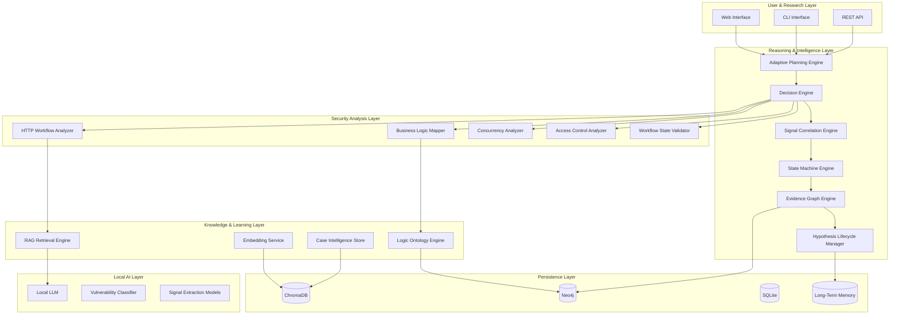
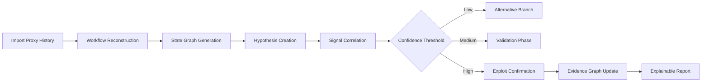

# LogicLlama
## Autonomous Business Logic Intelligence & Reasoning Platform

> A fully local AI-driven reasoning system designed to analyze, model, and understand business logic vulnerabilities through workflow intelligence, causal inference, adaptive traversal, and graph-native security reasoning.

---

# Vision

LogicLlama is not a traditional vulnerability scanner.  
It is not a wrapper around a language model.  
It is not a payload recommendation chatbot.

LogicLlama is an **Offensive Security Reasoning Engine** focused on one of the hardest unsolved domains in application security:

## Business Logic Vulnerabilities

Traditional tooling operates at the request level.  
LogicLlama operates at the workflow level.

Instead of asking:

> “What payload breaks this endpoint?”

LogicLlama asks:

> “What intended state transition, economic rule, trust assumption, or workflow dependency can be abused?”

The platform models applications as:

- State machines
- Economic systems
- Permission graphs
- Temporal workflows
- Causal dependency chains

---

# The Paradigm Shift

Traditional security scanners focus on:

- Static payloads
- Signature matching
- Isolated endpoint analysis
- Single-request testing

Business logic vulnerabilities are fundamentally different.

They are:

- Workflow abuses
- State machine violations
- Economic manipulation paths
- Temporal inconsistencies
- Trust-boundary failures

LogicLlama transforms offensive security from payload execution into reasoning-driven workflow intelligence.

---

# Core Philosophy

Applications are not collections of endpoints.

They are:

- Stateful systems
- Workflow engines
- Economic environments
- Permission graphs
- Temporal processes

LogicLlama continuously:

1. Reconstructs workflows
2. Maps state transitions
3. Generates attack hypotheses
4. Correlates behavioral signals
5. Dynamically adjusts confidence
6. Traverses attack branches
7. Builds explainable evidence graphs

---

# Core Architecture



---

# Intelligence Framework

## Adaptive Planning Engine

Responsible for autonomous traversal and execution orchestration.

Capabilities:

- Dynamic attack path generation
- Multi-branch exploration
- Context-aware execution
- Runtime graph traversal
- Failure recovery
- Priority scheduling

---

## Decision Engine

The Decision Engine ranks:

- Attack paths
- Tools
- Hypotheses
- Exploitation branches

Using:

- Weighted rule systems
- Confidence scoring
- Historical success/failure memory
- Adaptive scoring models
- Context-aware prioritization

### Decision Formula

```text
final_score =
base_score
+ matched_rule_weights
+ memory_bias
+ success_learning_boost
- historical_failure_penalty
```

---

## Signal Correlation Engine

Business logic flaws rarely reveal themselves through a single request.

LogicLlama correlates weak signals into high-confidence reasoning.

Examples:

- Response length anomalies
- Timing inconsistencies
- Duplicate transaction states
- Unauthorized transitions
- Workflow desynchronization
- Parallel execution anomalies

---

## State Machine Engine

Applications are reconstructed into explicit workflow states.

LogicLlama identifies:

- Illegal state transitions
- Workflow bypasses
- Missing validations
- Broken sequencing
- Trust violations

Example:

```text
Expected:
Cart → Checkout → Payment → Confirmation

Observed:
Cart → Confirmation
```

---

## Evidence Graph Engine

LogicLlama stores not only findings, but reasoning chains.

Every:

- Signal
- Decision
- Transition
- Hypothesis
- Validation step

becomes part of a causal evidence graph.

This enables:

- Explainable AI reasoning
- Replayable sessions
- Attack path visualization
- Security decision auditing
- Reinforcement learning foundations

---

# Offensive Analysis Modules

## HTTP Workflow Analyzer

Parses:

- Raw HTTP requests
- Burp Suite exports
- Proxy histories
- Session transitions
- Multi-step workflows

Extracts:

- Parameters
- Tokens
- Roles
- Temporal relations
- Workflow dependencies

---

## Business Logic Mapper

Transforms workflows into semantic logic graphs.

Detects:

- Workflow abuse
- Validation gaps
- Economic manipulation
- State inconsistencies
- Trust-boundary violations

---

## Concurrency Analyzer

Focused on temporal vulnerabilities:

- Race conditions
- Double-spend scenarios
- Reward duplication
- Eventual consistency flaws
- Multi-request exploitation

Supports:

- Parallel request simulation
- Race window analysis
- Temporal ordering validation

---

## Access Control Analyzer

Maps:

- Roles
- Resources
- Ownership boundaries
- Session relationships
- Privilege inheritance

Targets:

- IDOR
- Cross-role escalation
- Workflow authorization bypass
- Broken access control

---

# Knowledge & Ontology Layer

## RAG Retrieval Engine

Provides contextual intelligence from:

- PortSwigger Labs
- OWASP BLA
- Public writeups
- CVEs
- Internal research
- User-imported cases

Features:

- Semantic retrieval
- CWE-linked search
- Workflow-aware ranking
- Similarity clustering

---

## Business Logic Ontology

LogicLlama models vulnerabilities as traversable graph structures.

Example:

```text
Race Condition
    ↳ Economic Abuse
        ↳ Coupon Duplication
            ↳ Balance Inflation
```

This enables:

- Cross-pattern reasoning
- Semantic exploit discovery
- Structural vulnerability mapping
- Knowledge graph traversal

---

# Local AI Stack

LogicLlama is fully offline.

No sensitive workflows leave the machine.

## AI Components

- Llama 3.x via Ollama
- Local embeddings
- Local vector search
- Local reasoning pipelines
- Structured rule engines

The LLM assists reasoning.  
It does not blindly control execution.

---

# Temporal & Economic Intelligence

## Temporal Reasoning

Models:

- Request ordering
- Race windows
- Delayed consistency
- Async state propagation
- Synchronization flaws

---

## Economic Logic Layer

Tracks:

- Reward abuse
- Refund amplification
- Credit inflation
- Incentive manipulation
- Multi-account farming
- Transaction desynchronization

---

# Technology Stack

## Frontend

### Current
- Streamlit (Research / Internal UI)

### Future
- Next.js
- React
- Tailwind
- React Flow
- Cytoscape.js

---

## Backend

- FastAPI
- Async Python
- Event-driven architecture

---

## AI & Embeddings

- Ollama
- Llama 3.x
- Instructor Embeddings
- LlamaIndex

---

## Databases

### Neo4j
Graph-native ontology and evidence engine.

### ChromaDB
Semantic retrieval and vector search.

### SQLite
Operational telemetry and local persistence.

---

# Project Structure

```text
LogicLlama/
├── core_reasoning/       # Decision engine and hypothesis systems
├── workflow_analysis/    # HTTP parsing and workflow reconstruction
├── ontology_graph/       # Neo4j schemas and graph traversal
├── ai_stack/             # LLM orchestration and extraction models
├── persistence/          # Database adapters
├── safety_governance/    # Scope validation and execution controls
├── api_gateway/          # REST APIs and CLI routing
├── ui_layer/             # Web interfaces and visualizations
├── schemas/              # Typed reasoning schemas
├── simulations/          # Replay and attack simulations
├── datasets/             # Writeups and training corpora
└── docs/                 # Technical documentation
```

---

# Example Reasoning Flow



---

# Safety & Governance

LogicLlama implements bounded autonomous execution.

Controls include:

- Scope validation
- Rate limiting
- Destructive action prevention
- Branch depth limits
- Resource governance
- Human confirmation gates
- Session isolation
- Replay sandboxing

The platform prioritizes:

- Research safety
- Explainability
- Controlled experimentation
- Auditable execution

---

# Roadmap

## Completed

- [x] Local RAG Foundation
- [x] Interactive Mentorship Interface
- [x] Signal Extraction Engine
- [x] Adaptive Decision Layer
- [x] Event-Driven Architecture Migration
- [x] Confidence-Based Traversal Logic

---

## In Progress

- [ ] Neo4j Ontology Integration
- [ ] Automated Workflow Reconstruction
- [ ] Temporal Reasoning Engine
- [ ] Economic Exploitation Modeling
- [ ] Replayable Session Simulator
- [ ] Multi-Branch Autonomous Traversal

---

## Future Research

- [ ] Multi-Agent Security Reasoning
- [ ] Reinforcement Learning from Successful Exploits
- [ ] Autonomous Attack Surface Mapping
- [ ] Cross-Application Behavioral Clustering
- [ ] Interactive Graph Intelligence UI

---

# Research Direction

LogicLlama explores a new category of offensive security:

## Cognitive Offensive Security

Where systems reason about:

- Intent
- Workflow
- Time
- Trust
- Economics
- Human assumptions

instead of simply replaying payloads.

---

# License

MIT License.

---

# Final Statement

The future of application security is not static automation.

It is:

- Workflow intelligence
- State reasoning
- Temporal analysis
- Economic modeling
- Causal inference
- Explainable offensive AI

LogicLlama is building toward that future.
