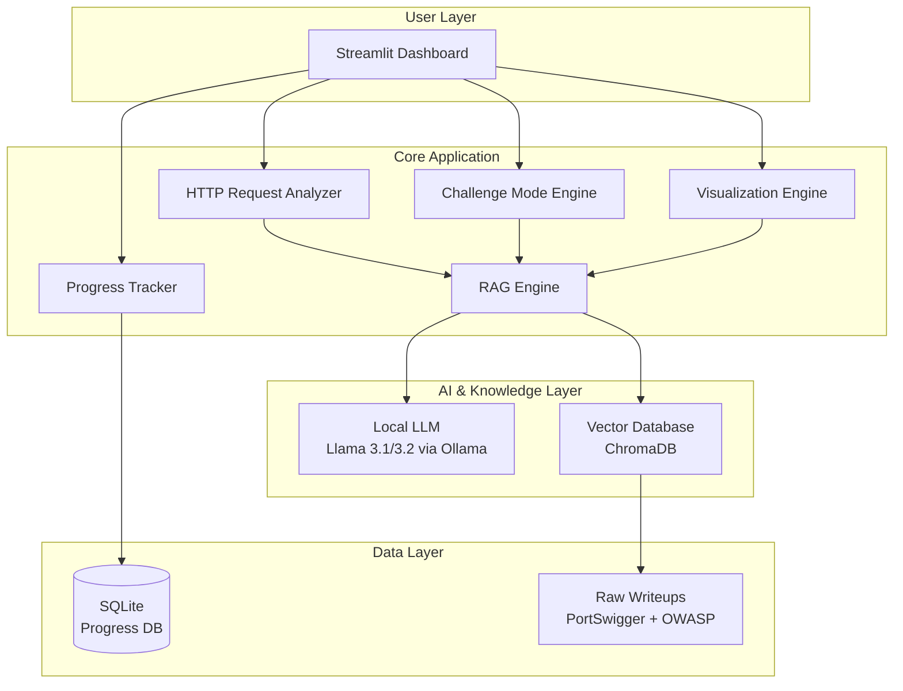
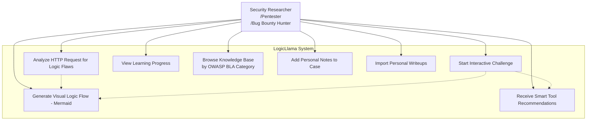
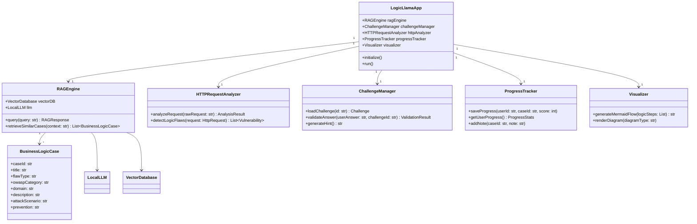

# LogicLlama: Your Personal Business Logic Mentor


**A fully local, privacy-first AI mentor specialized in Business Logic Vulnerabilities.**

---

## Overview

**LogicLlama** is an intelligent, offline AI-powered mentor designed specifically to help penetration testers, bug bounty hunters, and security researchers master **Business Logic Vulnerabilities** (Logic Flaws).

It acts as a personal tutor that provides interactive learning, contextual analysis of HTTP requests, visual explanations, and structured progress tracking — all while running **100% locally** to ensure complete privacy and data security.

---

## The Problem

Business Logic Vulnerabilities remain one of the hardest categories to detect and learn:

- Automated security scanners cannot understand business context and rules.
- Cloud-based LLMs pose significant privacy risks when analyzing sensitive HTTP requests or internal application logic.
- Quality educational materials are scattered across different platforms and difficult to study systematically.

---

## Our Solution

LogicLlama solves these challenges by combining a powerful local LLM with a carefully curated knowledge base using Retrieval-Augmented Generation (RAG). The entire system runs offline on your machine.

---

## Architecture

### High-Level Component Diagram



---

## Key Features

- **Challenge Mode**: Learn through realistic scenarios with interactive evaluation and hints.
- **HTTP Request Analyst**: Paste raw HTTP requests from Burp Suite or any proxy to detect potential logic flaws.
- **Smart Tool Advisor**: Get tailored recommendations for tools and testing methodologies.
- **Visual Logic Flow**: Generate clear Mermaid diagrams comparing normal vs. vulnerable workflows.
- **Progress Tracker**: Track your learning progress with personal notes using SQLite.

---

## Use Cases

### Supported Use Cases


---

## Core System Design

### High-Level Class Diagram


---

## Technology Stack

- **Large Language Model**: Llama 3.1 / 3.2 via Ollama (fully local)
- **RAG Framework**: LlamaIndex
- **Vector Database**: ChromaDB
- **Frontend**: Streamlit
- **Progress & Notes**: SQLite
- **Visualization**: Mermaid.js
- **All components run offline** after initial setup

---

## Project Structure

```plaintext
LogicLlama/
├── data/
│   ├── raw/                    # Original writeups and labs
│   └── processed/              # Processed and chunked documents
├── src/
│   ├── ingestion/              # Data ingestion and embedding pipeline
│   ├── rag/                    # RAG engine and retrieval logic
│   ├── analysis/               # HTTP Request Analyzer & Challenge logic
│   ├── core/                   # Main application services
│   └── ui/                     # Streamlit user interface
├── database/
│   └── progress.db             # SQLite database for user progress
├── docs/
│   └── diagrams/               # UML and architecture diagrams
├── README.md
├── requirements.txt
├── pyproject.toml
└── .env.example

## Getting Started

Detailed installation and setup instructions will be added once the core functionality is implemented.

### Prerequisites

- Python 3.11 or higher
- Ollama with Llama 3.1 or 3.2 model
- Git


## Roadmap

- Phase 1: Data Ingestion Pipeline & RAG Foundation
- Phase 2: Streamlit UI + Progress Tracker
- Phase 3: Challenge Mode + HTTP Request Analyst
- Phase 4: Visualization Engine & Tool Advisor
- Phase 5: Performance Optimization & Docker Support
- Phase 6: Documentation & Open Source Release

## Contributing
Contributions are welcome! Whether it's improving the knowledge base, enhancing prompts, fixing bugs, or adding new features — feel free to open an issue or submit a pull request.
See CONTRIBUTING.md for more details.

## License

This project is licensed under the MIT License.

Built with focus on privacy, education, and deep technical understanding.