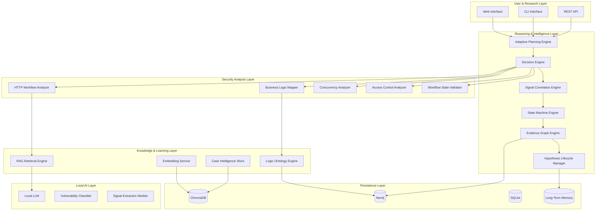
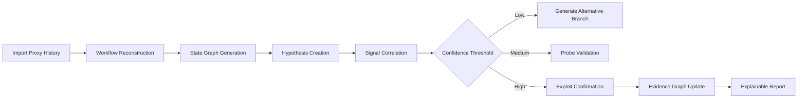

# LogicLlama
## Autonomous Business Logic Intelligence & Reasoning Platform

> A fully local AI-driven reasoning system designed to analyze, model, and understand business logic vulnerabilities through workflow intelligence, causal inference, adaptive traversal, and graph-native security reasoning.

---

# Vision

LogicLlama is not a traditional vulnerability scanner.
It is not a wrapper around a language model.
It is not a payload recommendation chatbot.

LogicLlama is an **Offensive Security Reasoning Engine** focused on one of the hardest unsolved domains in application security:

## Business Logic Vulnerabilities

Traditional tooling operates at the request level.
LogicLlama operates at the **workflow level**.

Instead of asking:

> “What payload breaks this endpoint?”

LogicLlama asks:

> “What intended state transition, economic rule, trust assumption, or workflow dependency can be abused?”

The platform models applications as:

- State machines
- Economic systems
- Permission graphs
- Temporal workflows
- Causal dependency chains

This creates a fundamentally different approach to offensive security reasoning.

---

# Why LogicLlama Exists

Business logic flaws remain among the most dangerous and least understood classes of vulnerabilities because:

- Automated scanners cannot infer business intent.
- Traditional fuzzing lacks contextual reasoning.
- Static payload testing fails against workflow-based exploits.
- Existing AI systems hallucinate attack paths without structured reasoning.
- Sensitive workflows cannot safely be uploaded to cloud-based LLMs.

LogicLlama addresses this by combining:

- Local AI execution
- Graph-native reasoning
- Event-driven state analysis
- Hypothesis-driven traversal
- Causal evidence tracking
- Retrieval-Augmented Security Knowledge

All running fully offline.

---

# Core Philosophy

LogicLlama treats applications as living systems.

The engine continuously:

1. Reconstructs workflows
2. Models intended state transitions
3. Generates exploitation hypotheses
4. Correlates runtime signals
5. Adjusts confidence dynamically
6. Traverses alternative attack branches
7. Builds explainable causal evidence graphs

This enables reasoning beyond:

- Payload injection
- Static endpoint scanning
- Regex-based anomaly detection
- Single-request analysis

---

# Intelligence Architecture



---

# Core Engines

## Adaptive Planning Engine

Responsible for autonomous traversal and execution orchestration.

Capabilities:

- Dynamic attack path generation
- Priority-based branch scheduling
- Context-aware execution planning
- Runtime graph traversal
- Failure recovery and rollback

The planner continuously recalculates the next best action based on:

- Signal confidence
- Historical outcomes
- Workflow state transitions
- Resource constraints
- Exploitation probability

---

## Decision Engine

The Decision Engine acts as the central reasoning core.

It ranks tools, attack paths, and hypotheses using:

- Weighted rule systems
- Confidence scoring
- Historical success/failure learning
- Contextual memory bias
- Adaptive scoring formulas

### Decision Formula

```text
final_score =
base_score
+ matched_rule_weights
+ memory_bias
+ success_learning_boost
- historical_failure_penalty
```

The engine supports:

- Min-max normalization
- Confidence-aware pruning
- Multi-branch prioritization
- Explainable ranking outputs

---

## Signal Correlation Engine

Business logic flaws rarely reveal themselves through a single response.

The Signal Engine correlates multiple weak indicators into meaningful exploit confidence.

Examples:

- Response length differentials
- Timing anomalies
- Duplicate transaction states
- Unauthorized state transitions
- Unexpected workflow success
- Parallel execution inconsistencies

Signals influence:

- Hypothesis confidence
- Branch traversal
- Vulnerability scoring
- Attack escalation

---

## State Machine Engine

The platform reconstructs workflows into explicit state models.

LogicLlama identifies:

- Expected transitions
- Forbidden transitions
- Missing validations
- Sequence bypasses
- Temporal inconsistencies

The engine understands workflows as:

```text
State A → State B → State C
```

and detects when:

```text
State A → State C
```

is improperly allowed.

---

## Evidence Graph Engine

Unlike traditional scanners, LogicLlama stores reasoning chains.

Every hypothesis, signal, transition, and decision becomes part of a causal graph.

This enables:

- Explainable AI security reasoning
- Replayable sessions
- Attack path visualization
- Debugging of AI decisions
- Future reinforcement learning

Stored in Neo4j as:

- Workflow nodes
- Vulnerability nodes
- Signal nodes
- State edges
- Causal relationships

---

# Security Analysis Layer

## HTTP Workflow Analyzer

Parses:

- Raw HTTP requests
- Proxy histories
- Burp Suite exports
- Multi-step flows
- Session transitions

Extracts:

- Parameters
- Tokens
- State indicators
- Role context
- Temporal relationships

---

## Business Logic Mapper

Transforms workflows into semantic logic graphs.

Detects:

- Workflow abuse
- Reward manipulation
- Missing validation
- Broken assumptions
- Economic exploit paths

---

## Concurrency Analyzer

Focused on race conditions and temporal abuse.

Capabilities:

- Parallel request simulation
- Race window detection
- Single-action duplication analysis
- Eventual consistency modeling
- Temporal ordering validation

Targets:

- Coupon reuse
- Balance inflation
- Double spending
- Vote duplication
- Reward amplification

---

## Access Control Analyzer

Maps relationships between:

- Roles
- Resources
- State ownership
- Permission inheritance
- Workflow privileges

Specialized for:

- IDOR
- Cross-role escalation
- Workflow authorization bypass
- Trust-boundary violations

---

# Knowledge & Learning Layer

## RAG Retrieval Engine

Provides contextual retrieval over:

- PortSwigger labs
- OWASP BLA
- CVEs
- Writeups
- Internal case intelligence
- User-imported research

Features:

- Semantic chunking
- Similarity search
- CWE-linked retrieval
- Workflow-aware ranking

---

## Business Logic Ontology

The ontology layer creates a graph-native representation of logic vulnerabilities.

Examples:

```text
Race Condition
    ↳ Economic Abuse
        ↳ Coupon Duplication
            ↳ Reward Inflation
```

This allows:

- Cross-pattern reasoning
- Semantic vulnerability traversal
- Structural exploit discovery
- Knowledge clustering

---

# AI Stack

## Fully Local AI Execution

LogicLlama is privacy-first.

All components run offline:

- Llama 3.x via Ollama
- Local embeddings
- Local vector search
- Local workflow analysis

No HTTP requests or internal workflows are exposed externally.

---

## Structured AI Reasoning

The platform avoids raw LLM execution for critical logic.

Instead, it combines:

- Deterministic rule engines
- Structured DSL execution
- Typed schemas
- Confidence scoring
- Graph validation

The LLM assists reasoning.
It does not control execution blindly.

---

# Temporal & Economic Intelligence

LogicLlama extends beyond traditional web security.

## Temporal Reasoning

Models:

- Request ordering
- Race windows
- Delayed consistency
- Async state propagation
- Multi-node synchronization flaws

---

## Economic Logic Layer

Tracks:

- Incentive abuse
- Reward duplication
- Balance inflation
- Refund amplification
- Token farming
- Credit desynchronization

This enables detection of:

- Financial exploitation chains
- Marketplace manipulation
- Reward system abuse
- Multi-account farming strategies

---

# Technology Stack

## Frontend

- Streamlit
- Next.js
- Mermaid.js

## AI & Embeddings

- Ollama
- Llama 3.x
- Instructor Embeddings
- LlamaIndex

## Databases

### Neo4j
Primary graph engine for:

- Ontology traversal
- Evidence graphs
- Workflow relations
- Causal reasoning

### ChromaDB
Used for:

- Vector retrieval
- Semantic search
- RAG similarity queries

### SQLite
Operational storage for:

- Telemetry
- User progress
- Replay sessions
- Local metadata

---

# Project Structure

```text
LogicLlama/
├── core_reasoning/       # Decision engine, hypotheses, confidence scoring
├── workflow_analysis/    # HTTP parsing and workflow reconstruction
├── ontology_graph/       # Neo4j schemas and ontology traversal
├── ai_stack/             # Local LLM orchestration and extraction models
├── persistence/          # Database adapters and storage layers
├── safety_governance/    # Scope validation and bounded execution
├── api_gateway/          # REST APIs and CLI routing
├── ui_layer/             # Frontend interfaces and visualization
├── schemas/              # Typed reasoning and ontology schemas
├── simulations/          # Attack replay and workflow simulation
├── datasets/             # Security writeups and training corpora
└── docs/                 # Architecture and technical documentation
```

---

# Example Offensive Reasoning Flow



---

# Safety & Governance

LogicLlama is designed with bounded autonomous execution.

Core controls include:

- Scope validation
- Rate limiting
- Destructive action prevention
- Branch depth limits
- Resource governance
- Human confirmation gates
- Session isolation
- Replay sandboxing

The platform prioritizes:

- Research safety
- Explainability
- Controlled experimentation
- Auditable execution

---

# Roadmap

## Completed

- [x] Local RAG Knowledge Base
- [x] Interactive Mentorship UI
- [x] Signal Extraction Schema
- [x] Adaptive Decision Engine
- [x] Event-Driven Architecture Migration
- [x] Confidence-Based Traversal Logic
- [x] Hypothesis Lifecycle Management

## In Progress

- [ ] Neo4j Graph-Native Ontology
- [ ] Automated Workflow Reconstruction
- [ ] Temporal Reasoning Engine
- [ ] Economic Exploitation Modeling
- [ ] Replayable Session Simulator
- [ ] Autonomous Multi-Branch Exploration

## Future Vision

- [ ] Multi-Agent Cooperative Reasoning
- [ ] Reinforcement Learning from Successful Exploits
- [ ] Cross-Application Behavioral Clustering
- [ ] Autonomous Attack Surface Modeling
- [ ] Interactive Graph Visualization Interface

---

# Research Direction

LogicLlama explores a new category of offensive security:

## Cognitive Offensive Security

Where systems reason about:

- Intent
- State
- Time
- Trust
- Economics
- Human workflow assumptions

instead of merely replaying payloads.

---

# License

MIT License.

---

# Final Statement

LogicLlama is an attempt to push offensive security beyond static automation.

The future of application security is not payload generation.

It is:

- Workflow intelligence
- State reasoning
- Causal analysis
- Temporal modeling
- Adaptive exploitation
- Explainable offensive AI

LogicLlama is building toward that future.

