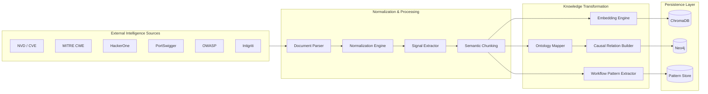

# Trusted Intelligence & Knowledge Pipeline

LogicLlama is powered by a multi-layered intelligence pipeline that combines official vulnerability feeds, real-world exploitation writeups, workflow-centric security research, and graph-native ontology mapping.

The canonical source inventory lives in [DATA_INVENTORY.md](DATA_INVENTORY.md) and [SOURCE_MANIFEST.json](SOURCE_MANIFEST.json). Those files define what is bundled locally today and what is synced from authoritative public sources.

Unlike traditional RAG systems that merely index text documents, LogicLlama transforms raw security intelligence into structured reasoning artifacts used for autonomous workflow analysis and business logic inference.

---

# Intelligence Data Architecture



---

# Official Vulnerability Intelligence Sources

## NVD — National Vulnerability Database

- Source of structured CVE metadata
- Used for:
  - CVE ↔ CWE mapping
  - CVSS prioritization
  - exploitability scoring
  - affected product intelligence

### Integrated Fields
- CVE IDs
- CWE Relationships
- CVSS Scores
- Attack Vector
- CPE Metadata

### Usage in LogicLlama
LogicLlama enriches vulnerability ontology nodes using NVD metadata to improve reasoning confidence and attack-path prioritization.

---

## MITRE CWE

Primary source for vulnerability taxonomy and semantic relationships.

### Usage
- Maps workflow flaws to standardized weakness classes
- Builds ontology edges between related vulnerability families
- Enables cross-pattern reasoning

### Example Relations
- CWE-362 → Race Condition
- CWE-840 → Business Logic Errors
- CWE-639 → IDOR
- CWE-841 → Workflow Enforcement Violations

---

## CISA KEV

Known Exploited Vulnerabilities feed used for real-world exploit weighting.

### Usage
- Raises confidence score for actively exploited patterns
- Improves risk prioritization
- Feeds temporal exploit intelligence layer

---

# Real-World Offensive Intelligence Sources

## HackerOne Hacktivity

One of the primary real-world business logic learning sources.

### Extracted Intelligence
- workflow abuse patterns
- race-condition exploitation paths
- economic abuse scenarios
- access-control bypass chains

### AI Processing
Writeups are automatically:
- chunked semantically
- embedded into vector space
- linked into ontology graphs
- converted into reusable attack patterns

---

## PortSwigger Web Security Academy

Primary educational and behavioral workflow modeling source.

### Usage
- Challenge generation
- Workflow reconstruction training
- Signal extraction benchmarking
- Logic flaw simulation datasets

### Current Local Reference Records

- [portswigger_access_control_reference.json](../data/fixtures/portswigger_access_control_reference.json)
- [portswigger_business_logic_reference.json](../data/fixtures/portswigger_business_logic_reference.json)

### What Is Captured

- Access control, privilege escalation, and IDOR guidance.
- Business logic, workflow assumptions, and state validation guidance.

---

## OWASP Top Ten Web Application Security Risks

Used as the methodological foundation layer and a public risk baseline.

### Integrated Domains
- Business Logic Testing
- Access Control Testing
- State Validation
- Multi-Step Workflow Analysis

### Current Local Reference Record

- [owasp_top_ten_reference.json](../data/fixtures/owasp_top_ten_reference.json)

### What Is Captured

- The OWASP Top Ten as the baseline risk framework.
- Broken access control and logic flaws as the current reasoning families.

The current runtime consumes these references directly through SQLite-backed ingestion and search. The richer graph, simulation, and AI reasoning fields in the master schema are planned layers, not yet part of the base release.

### Historical Edition Records

- [owasp_top_ten_2025.json](../data/fixtures/owasp_editions/owasp_top_ten_2025.json)
- [owasp_top_ten_2021.json](../data/fixtures/owasp_editions/owasp_top_ten_2021.json)
- [owasp_top_ten_2017.json](../data/fixtures/owasp_editions/owasp_top_ten_2017.json)
- [owasp_top_ten_2013.json](../data/fixtures/owasp_editions/owasp_top_ten_2013.json)
- [owasp_top_ten_2010.json](../data/fixtures/owasp_editions/owasp_top_ten_2010.json)
- [owasp_top_ten_2007.json](../data/fixtures/owasp_editions/owasp_top_ten_2007.json)
- [OWASP_EDITIONS_MANIFEST.json](../data/fixtures/owasp_editions/OWASP_EDITIONS_MANIFEST.json)

---

## Snapshot Archives (Local)

The current release includes local snapshot archives for deterministic analysis, reproducible ingestion runs, and future model-training preparation.

### CWE Snapshot Archive

- [CWE_SNAPSHOTS_MANIFEST.json](../data/fixtures/cwe_snapshots/CWE_SNAPSHOTS_MANIFEST.json)
- Versioned ZIP snapshots under [data/fixtures/cwe_snapshots](../data/fixtures/cwe_snapshots)

### KEV Snapshot Archive

- [kev_current.json](../data/fixtures/kev_snapshots/kev_current.json)
- [KEV_SNAPSHOTS_MANIFEST.json](../data/fixtures/kev_snapshots/KEV_SNAPSHOTS_MANIFEST.json)

### Archive Utilities

- [archive_cwe_snapshots.py](../src/ingestion/archive_cwe_snapshots.py)
- [archive_kev_snapshots.py](../src/ingestion/archive_kev_snapshots.py)
- [curate_owasp_editions.py](../src/ingestion/curate_owasp_editions.py)

---

# Knowledge Transformation Pipeline

LogicLlama does not store raw writeups directly.

Every document passes through a multi-stage intelligence pipeline.

## Stage 1 — Normalization

The system extracts:
- endpoints
- roles
- parameters
- state transitions
- economic actions
- timing indicators

---

## Stage 2 — Semantic Chunking

Documents are split by:
- workflow step
- exploit stage
- causal relation
- attacker objective

This significantly improves retrieval precision over naive chunking.

---

## Stage 3 — Ontology Mapping

The AI maps extracted intelligence into graph-native structures.

### Example

```plaintext
Race Condition
    ├── affects → Coupon Redemption
    ├── causes → Balance Duplication
    ├── related_to → CWE-362
    └── overlaps → Workflow Bypass
```

---

## Stage 4 — Signal Extraction

LogicLlama extracts behavioral signals such as:

- response_length_diff
- duplicate_transaction
- latency_spike
- unexpected_state_transition
- state_desynchronization

These become reusable reasoning primitives for autonomous analysis.

---

# Data Quality & Validation Framework

LogicLlama implements strict validation rules before intelligence becomes part of the reasoning layer.

## Validation Rules

- CVE must exist in NVD
- CWE mapping must match MITRE taxonomy
- exploit chain must contain reproducible workflow
- references must originate from trusted sources
- duplicate semantic patterns are merged automatically

---

# Storage Architecture

## ChromaDB

Used for:
- semantic retrieval
- contextual similarity search
- attack pattern retrieval

---

## Neo4j

Used for:
- ontology relationships
- causal evidence graphs
- workflow state transitions
- attack path traversal

---

## SQLite

Used for:
- operational telemetry
- session tracking
- learning progress
- local analytics

---

# Autonomous Learning Layer

LogicLlama continuously improves its reasoning capabilities by learning from:

- successful attack chains
- failed hypotheses
- workflow similarities
- recurring state-machine violations
- temporal exploitation patterns

This allows the platform to evolve from static retrieval into adaptive offensive reasoning.

---

# Future Intelligence Expansion

Planned future integrations include:

- public exploit repositories
- temporal exploit datasets
- economic abuse simulation corpora
- multi-agent workflow replay systems
- browser automation telemetry
- distributed workflow tracing

---

# Intelligence Philosophy

LogicLlama treats vulnerabilities as behavioral systems rather than isolated payloads.

The objective is not merely to identify vulnerable requests, but to understand:

- why workflows fail
- how states become inconsistent
- where trust boundaries collapse
- when economic incentives become exploitable

That is the foundation of autonomous business logic reasoning.
