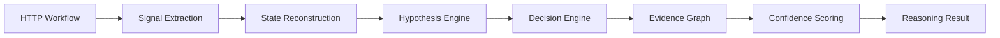

# LogicLlama — Advanced Implementation Guide

## Overview

This guide describes the production-grade implementation architecture for LogicLlama after its evolution from a simple RAG mentor into a graph-native business logic reasoning platform. The current runtime is deterministic and local-first; the more advanced autonomous layers remain part of the roadmap.

LogicLlama is no longer a basic Streamlit + RAG application.

The platform now consists of:

- Planned autonomous reasoning engines
- Workflow reconstruction systems
- Ontology-driven graph intelligence
- Multi-database persistence
- Signal correlation engines
- Local AI orchestration
- Event-driven execution pipelines

## Current Release Status

The current release is local-first and deterministic. It already ships with a verified public-source corpus and does not depend on a trained model to produce useful results.

The active corpus now includes:

- Historical NVD coverage from 1999 through 2025
- MITRE CWE versioned snapshots for taxonomy tracking
- CISA KEV current catalog for prioritization examples
- OWASP Top Ten editions from 2007, 2010, 2013, 2017, 2021, and 2025
- PortSwigger reference records for access control and business-logic guidance

The canonical inventory for those sources is maintained in [DATA_INVENTORY.md](DATA_INVENTORY.md) and [SOURCE_MANIFEST.json](SOURCE_MANIFEST.json).

---

# Recommended System Architecture

## Development Mode

```plaintext
Frontend:
- Streamlit (fast prototyping)
- Optional: Next.js UI

Backend:
- FastAPI
- Python Async Services

AI Stack:
- Ollama
- Llama 3.x
- Instructor Embeddings

Databases:
- ChromaDB
- Neo4j
- SQLite
```

---

# Production Recommendation

| Layer | Recommended Technology |
|---|---|
| Frontend | Next.js |
| API Layer | FastAPI |
| AI Runtime | Ollama |
| Workflow Engine | Async Python Services |
| Graph Engine | Neo4j |
| Vector Store | ChromaDB |
| Telemetry | SQLite / PostgreSQL |
| Deployment | Docker Compose |

---

# System Requirements

## Minimum Requirements

| Component | Requirement |
|---|---|
| CPU | 6 cores |
| RAM | 16 GB |
| GPU | Optional |
| Storage | 20 GB SSD |
| Python | 3.11+ |

---

# Required Software

## Core Dependencies

- Python 3.11+
- Ollama
- Docker
- Neo4j
- Git

---

# Python Dependencies

```bash
pip install -r requirements.txt
```

---

# Project Structure

```plaintext
LogicLlama/
├── core_reasoning/
│   ├── planner/
│   ├── hypothesis/
│   ├── decision_engine/
│   ├── signal_correlation/
│   └── confidence_scoring/
│
├── workflow_analysis/
│   ├── http_parser/
│   ├── state_machine/
│   ├── workflow_mapper/
│   └── concurrency_analysis/
│
├── ontology_graph/
│   ├── neo4j_adapter/
│   ├── relation_builder/
│   └── ontology_models/
│
├── ai_stack/
│   ├── rag/
│   ├── embeddings/
│   ├── llm_runtime/
│   └── extraction_models/
│
├── persistence/
│   ├── chromadb/
│   ├── sqlite/
│   └── memory_store/
│
├── api_gateway/
│   ├── rest/
│   ├── websocket/
│   └── cli/
│
├── ui_layer/
│   ├── streamlit/
│   └── nextjs/
│
├── safety_governance/
│   ├── scope_validation/
│   ├── execution_limits/
│   └── sandbox_rules/
│
└── data/
```

---

# Step 1 — Environment Setup

## Create Virtual Environment

```bash
python -m venv .venv
```

## Activate Environment

### Linux / macOS

```bash
source .venv/bin/activate
```

### Windows

```bash
.venv\Scripts\activate
```

---

# Step 2 — Install Dependencies

```bash
pip install -r requirements.txt
```

---

# Step 3 — Install Ollama

## Download

https://ollama.com/download

---

# Pull Required Models

```bash
ollama pull llama3.2
ollama pull nomic-embed-text
```

---

# Verify Models

```bash
ollama list
```

---

# Step 4 — Start Neo4j

## Docker Example

```bash
docker run \
--name logicllama-neo4j \
-p7474:7474 \
-p7687:7687 \
-e NEO4J_AUTH=neo4j/password \
-d neo4j
```

---

# Step 5 — Ingest Bundled References

```bash
python -m src.core.cli ingest-fixtures
```

This loads verified local references into SQLite:

- OWASP Top Ten baseline record
- PortSwigger access-control record
- PortSwigger business-logic record

---

# Step 6 — Sync Public Feeds

```bash
python -m src.core.cli sync --nvd-limit 25 --cwe-limit 100
```

For controlled historical NVD backfill:

```bash
python -m src.core.cli sync --skip-kev --skip-cwe --nvd-year 2025 --nvd-limit 60
python -m src.core.cli sync-history --start-year 1999 --end-year 2025
```

This step updates:

- NVD CVE records
- MITRE CWE taxonomy records
- CISA KEV exploited-vulnerability records

---

# Step 7 — (Optional) Archive Historical Snapshots

```bash
python src/ingestion/archive_cwe_snapshots.py
python src/ingestion/archive_kev_snapshots.py
python src/ingestion/curate_owasp_editions.py
```

This produces versioned local archives under `data/fixtures/` for:

- CWE snapshots
- KEV snapshots
- OWASP Top Ten edition records

---

# Step 8 — Generate Inventory Report

```bash
python -m src.core.cli report --format text --limit 10
```

For machine-readable output:

```bash
python -m src.core.cli report --format json
```

---

# Step 9 — Start Frontend

## Streamlit (Development)

```bash
streamlit run src/ui/app.py
```

---

## Next.js (Production)

```bash
npm install
npm run dev
```

---

# Autonomous Reasoning Pipeline

## Runtime Execution Flow



---

# Workflow Reconstruction Engine

LogicLlama reconstructs application behavior using:

- proxy history
- request sequences
- role transitions
- state mutations
- timing analysis

---

# Signal Correlation Engine

Extracted signals include:

- response_length_diff
- latency_spike
- duplicate_transaction
- unexpected_state
- state_desync
- privilege_transition

---

# Hypothesis Lifecycle

Each vulnerability hypothesis passes through:

| Stage | Description |
|---|---|
| created | Initial generation |
| active | Currently evaluated |
| confirmed | Evidence threshold reached |
| discarded | Invalidated |

---

# Event-Driven Architecture

LogicLlama uses asynchronous event processing.

## Example Events

```plaintext
request_received
workflow_reconstructed
signal_detected
confidence_updated
hypothesis_confirmed
```

---

# Testing

# Unit Tests

```bash
pytest tests/
```

---

# Coverage

```bash
pytest --cov=.
```

---

# Graph Validation

```bash
python tests/test_ontology_graph.py
```

---

# Workflow Simulation

```bash
python tests/test_workflow_engine.py
```

---

# Deployment

# Docker Compose

```bash
docker-compose up -d
```

---

# Example Services

```yaml
services:
  api:
  ollama:
  chromadb:
  neo4j:
  frontend:
```

---

# Monitoring & Telemetry

## Runtime Monitoring

```bash
python monitoring/runtime_monitor.py
```

---

# Performance Reports

```bash
python monitoring/performance_report.py
```

---

# Maintenance

# Update CVE Intelligence

```bash
python scripts/update_nvd.py
```

---

# Update Writeups

```bash
python scripts/update_writeups.py
```

---

# Rebuild Embeddings

```bash
python scripts/rebuild_embeddings.py
```

---

# Rebuild Ontology Graph

```bash
python scripts/rebuild_graph.py
```

---

# Troubleshooting

# Ollama Not Running

```bash
ollama serve
```

---

# Neo4j Connection Issues

```bash
docker restart logicllama-neo4j
```

---

# ChromaDB Corruption

```bash
rm -rf data/chroma_db
python scripts/rebuild_embeddings.py
```

---

# Streamlit Port Conflict

```bash
streamlit run ui_layer/streamlit/app.py --server.port 8502
```

---

# Security Governance

LogicLlama enforces:

- scope validation
- bounded execution
- rate limiting
- safe workflow replay
- non-destructive execution rules

---

# Recommended Development Strategy

## Phase 0

- Data foundation
- Provenance-preserving ingestion
- Canonical inventory and manifests

This phase is complete in the current release.

## Phase 1

- Core RAG
- Ontology ingestion
- Workflow parser

---

## Phase 2

- Signal extraction
- State reconstruction
- Evidence graph engine

---

## Phase 3

- Hypothesis engine
- Adaptive traversal
- Autonomous reasoning

---

## Phase 4

- Temporal analysis
- Economic reasoning
- Distributed workflow intelligence

---

# Final Philosophy

LogicLlama is not a traditional scanner.

It is an autonomous reasoning platform designed to understand:

- workflows
- behavioral systems
- state transitions
- economic abuse
- causal vulnerability chains

The implementation architecture reflects that philosophy at every layer.
